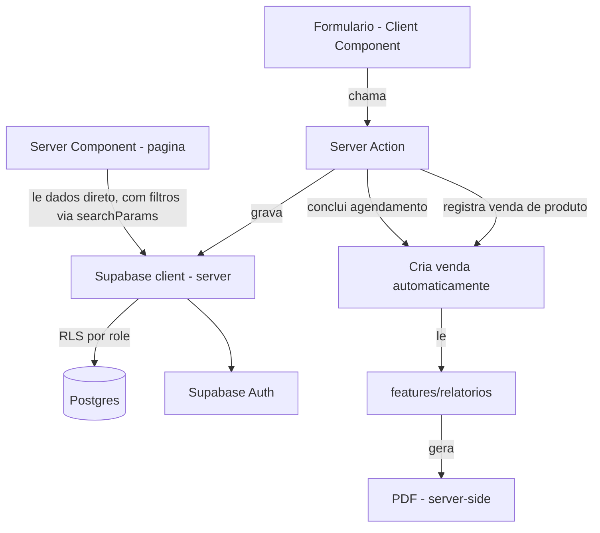

# PetManager Completo — Design

**Spec**: `.specs/features/petmanager-completo/spec.md`
**Status**: Draft

---

## Architecture Overview

Sem mudança na arquitetura de base herdada do MVP (T1-T8, já
construída e funcionando): Next.js App Router, Server Components para
leitura, Server Actions para escrita, Supabase (Postgres + Auth) como
única fonte de dados, RLS como camada real de controle de acesso (não
só UI). Nenhuma API REST separada.



Estrutura por domínio, sem mudança de convenção — só domínios novos:

```
src/
  app/
    (auth)/login/
    (dashboard)/
      agenda/
      pets/
      servicos/
      vacinas/
      estoque/
      vendas/                    # NOVO
      relatorios/
      horario-funcionamento/
  features/
    agenda/                      # revisado: cria venda ao concluir
    pets/
    servicos/
    vacinas/
    estoque/                     # revisado: sem saída direta
    vendas/                      # NOVO
    relatorios/                  # revisado: lê de vendas, gera PDF
    auth/
  shared/
    supabase/
      client.ts
      server.ts                  # já existe (T8)
    ui/
    filters/                     # NOVO — hook + componente de busca/filtro reutilizável
      use-list-filters.ts
      search-filter-bar.tsx
    pdf/                         # NOVO — geração de PDF server-side
      relatorio-pdf.tsx
```

---

## Code Reuse Analysis

Reaproveita integralmente a infra do MVP (T1-T8): projeto Next.js,
Supabase configurado, migrations `0001`-`0003` (profiles, tabelas de
domínio, RLS), Vitest, Playwright, `shared/supabase/server.ts`. Nenhum
código do protótipo v0.dev é reaproveitado (ver AD-006 em `STATE.md`)
— serviu só de referência visual (paleta escura + destaque ciano,
layout de sidebar, cards de métrica no dashboard).

---

## Components

### `features/auth`, `features/horario-funcionamento`, `features/pets`, `features/servicos`, `features/vacinas`

Sem mudança de design em relação ao MVP original — ver
`.specs/features/petmanager-mvp/design.md` para as interfaces
detalhadas. Só ganham integração com `shared/filters` nas telas de
listagem (pets, vacinas).

### `features/agenda` (revisado)

- **Purpose**: Criar, editar, cancelar, reabrir e concluir
  agendamentos — concluir agora também cria uma venda.
- **Location**: `src/features/agenda/`
- **Interfaces**:
  - `criarAgendamento`, `editarAgendamento`, `cancelarAgendamento`, `reabrirAgendamento` — sem mudança (AGD-01 a AGD-06)
  - `concluirAgendamento(id: string): Promise<{ error?: string }>` (AGD-07) — **revisado**: dentro da mesma transação, insere 1 linha em `vendas` (tipo `servico`, `agendamento_id = id`, valor = soma do `preco_interno` dos serviços vinculados)
  - `reabrirAgendamentoConcluido(id: string): Promise<{ error?: string }>` (AGD-08) — **novo**: remove a venda associada (`vendas.agendamento_id = id`) antes de voltar o status para "agendado"
  - `getAgendamentosPorDia(data: string): Promise<Agendamento[]>` (AGD-02)
  - `getAgendamentosFiltrados(filtro: { busca?: string; status?: string }): Promise<Agendamento[]>` (AGD-09, FILT-01, FILT-02) — usada na listagem, não na visão de agenda diária
- **Dependencies**: `features/horario-funcionamento`, `features/pets`, `features/servicos`, `features/vendas`
- **Reuses**: `shared/supabase/server.ts`, `shared/filters`

### `features/estoque` (revisado — sem saída direta)

- **Purpose**: Cadastro de produto e entrada de estoque. Saída deixa
  de existir como ação própria — passa a ser consequência de uma
  venda (ver `features/vendas`).
- **Location**: `src/features/estoque/`
- **Interfaces**:
  - `criarProduto(input: ProdutoInput): Promise<{ error?: string }>`
  - `registrarEntrada(produtoId: string, quantidade: number): Promise<{ error?: string }>` (EST-01)
  - `getProdutos(filtro?: { busca?: string; categoria?: string }): Promise<Produto[]>` (EST-04, FILT-01, FILT-02) — inclui flag `estoqueBaixo` calculada (saldo ≤ mínimo)
  - ~~`registrarSaida`~~ — **removida**; a saída agora só acontece via `features/vendas/registrarVendaProduto`, que grava em `movimentacoes_estoque` internamente
- **Dependencies**: Supabase (`produtos`, `movimentacoes_estoque`)
- **Reuses**: `shared/supabase/server.ts`, `shared/filters`
- **Restrição de acesso**: `dono` apenas (EST-04), reforçado por RLS

### `features/vendas` ⭐ NOVO

- **Purpose**: Fonte única de faturamento — toda venda de produto ou
  serviço passa por aqui.
- **Location**: `src/features/vendas/`
- **Interfaces**:
  - `criarVendaServico(agendamentoId: string, valorTotal: number): Promise<{ error?: string }>` (VEN-01) — chamada internamente por `agenda.concluirAgendamento`, nunca diretamente por um formulário (sem UI própria para editar valor de venda de serviço)
  - `removerVendaDoAgendamento(agendamentoId: string): Promise<{ error?: string }>` (VEN-01, estorno) — chamada por `agenda.reabrirAgendamentoConcluido`
  - `registrarVendaProduto(input: { produtoId: string; quantidade: number }): Promise<{ error?: string }>` (VEN-02, VEN-03) — valida saldo, calcula `valor_total`, grava `vendas` + `movimentacoes_estoque` numa única transação (função Postgres `registrar_venda_produto`, ver Data Models)
  - `getVendas(filtro?: { busca?: string; tipo?: 'produto' | 'servico'; mes?: string }): Promise<Venda[]>` (VEN-05, FILT-01, FILT-02)
- **Dependencies**: `features/estoque` (saldo), `features/servicos` (preço interno), `features/agenda` (origem)
- **Reuses**: `shared/supabase/server.ts`, `shared/filters`
- **Restrição de acesso**: `registrarVendaProduto` exclusivo a `dono` (VEN-04); `getVendas` acessível a ambos os papéis (é o mesmo nível de acesso da Agenda)

### `features/relatorios` (revisado — lê de `vendas`, gera PDF)

- **Purpose**: Dashboard mensal e exportação em PDF.
- **Location**: `src/features/relatorios/`
- **Interfaces**:
  - `getRelatorioMensal(ano: number, mes: number): Promise<RelatorioMensal>` (REL-01 a REL-04) — **revisado**: faturamento agora é `SUM(vendas.valor_total)` do mês, não mais dois cálculos separados
  - `gerarRelatorioPdf(ano: number, mes: number): Promise<{ error?: string; url?: string }>` (REL-06, REL-07) — Server Action que monta o PDF server-side (ver Tech Decisions) e retorna uma URL de download temporária (ou o buffer direto, decidido na implementação/T da fase Execute)
- **Dependencies**: `features/agenda`, `features/vendas`
- **Reuses**: `shared/supabase/server.ts`, `shared/pdf/relatorio-pdf.tsx`
- **Restrição de acesso**: exclusivo ao papel `dono` (REL-05)

### `shared/filters` ⭐ NOVO (cross-cutting, AD-002)

- **Purpose**: Componente + hook reutilizados por toda tela de listagem
  (agenda, pets, vacinas, produtos, vendas) — evita reimplementar busca
  debounced e sincronização com `searchParams` cinco vezes.
- **Location**: `src/shared/filters/`
- **Interfaces**:
  - `<SearchFilterBar />` — Client Component: input de busca (debounced) + `<select>` opcional de atributo, sincroniza com a URL via `useSearchParams`/`router.replace`
  - `useListFilters<T extends string>(atributos: T[])` — hook que lê os `searchParams` atuais e devolve `{ busca, filtro, setBusca, setFiltro }`
- **Dependencies**: Next.js navigation (`useSearchParams`, `useRouter`)
- **Reuses**: N/A (é a própria peça reutilizável)

### `shared/pdf` ⭐ NOVO

- **Purpose**: Geração de PDF do relatório mensal, server-side.
- **Location**: `src/shared/pdf/relatorio-pdf.tsx`
- **Interfaces**: `renderRelatorioPdf(dados: RelatorioMensal): Promise<Buffer>`
- **Dependencies**: `@react-pdf/renderer` (ver Tech Decisions)
- **Reuses**: N/A

---

## Data Models

```typescript
// Tipos já existentes (profiles, horarios_funcionamento, tutores, pets,
// servicos, agendamentos, agendamento_servicos, vacinas) sem mudança —
// ver design.md do petmanager-mvp.

interface Produto {
  id: string
  nome: string
  categoria: string
  precoUnitario: number
  saldoEstoque: number
  estoqueMinimo: number // NOVO campo — alimenta alerta de estoque baixo (EST controle)
}

interface MovimentacaoEstoque {
  id: string
  produtoId: string
  tipo: 'entrada' | 'saida' // 'saida' só é criada via venda, nunca diretamente
  quantidade: number
  vendaId: string | null // NOVO — rastreia qual venda causou a saída
  data: string
}

// NOVO
interface Venda {
  id: string
  tipo: 'servico' | 'produto'
  agendamentoId: string | null // preenchido só quando tipo = 'servico'
  produtoId: string | null     // preenchido só quando tipo = 'produto'
  servicoIds: string[] | null  // snapshot dos serviços, só quando tipo = 'servico'
  quantidade: number           // sempre 1 para serviço; variável para produto
  valorTotal: number
  criadoPor: string            // usuarioId
  criadoEm: string             // ISO 8601, usado para o filtro por mês
}
```

**Relationships (novas/alteradas)**: `Venda.agendamentoId → Agendamento.id`
(nullable) · `Venda.produtoId → Produto.id` (nullable) ·
`MovimentacaoEstoque.vendaId → Venda.id` (nullable). Constraint:
exatamente um de `agendamentoId`/`produtoId` deve ser não-nulo por
venda (`CHECK` no banco, coerente com `tipo`).

**Migration nova necessária** (fase Execute, tarefa a definir):
`0004_vendas.sql` — cria tabela `vendas`, adiciona `estoque_minimo` e
`venda_id` em `produtos`/`movimentacoes_estoque`, cria a função
Postgres `registrar_venda_produto(produto_id, quantidade)` (transação
atômica: valida saldo, insere `venda`, insere `movimentacao_estoque`,
debita `produtos.saldo_estoque` — tudo ou nada), e as RLS policies
correspondentes (`vendas`: leitura para `authenticated`, escrita de
`tipo = 'produto'` restrita a `dono`; escrita de `tipo = 'servico'`
só através da função chamada por `concluirAgendamento`, nunca por
INSERT direto do cliente).

RLS: segue exatamente o padrão já estabelecido em AD-003
(`(select auth.uid())`, nunca linha a linha) e a função helper
`current_role_petmanager()` já existente — nenhuma mudança na
abordagem, só novas policies na tabela nova.

---

## Error Handling Strategy

| Error Scenario | Handling | User Impact |
|---|---|---|
| Falha de rede/Supabase ao salvar | Herdado do MVP — erro genérico, formulário preservado | "Não foi possível salvar, tente novamente" |
| Venda de produto com quantidade > saldo | Função `registrar_venda_produto` rejeita antes de gravar (checagem atômica no banco, não só na Server Action) | "Saldo insuficiente" com saldo atual exibido |
| Falha na geração do PDF | `gerarRelatorioPdf` captura o erro e retorna `{ error }`; a tela do relatório continua funcionando normalmente | Mensagem de erro isolada, sem quebrar a visualização em tela (REL-07) |
| Reabrir agendamento concluído sem venda associada (estado inconsistente) | `removerVendaDoAgendamento` trata "nenhuma linha encontrada" como sucesso silencioso (idempotente), não como erro | Reabrir nunca falha por causa disso |
| Filtro/busca sem resultados | Lista renderiza estado vazio explícito ("Nenhum resultado encontrado"), nunca tela em branco ambígua | Feedback claro de que o filtro é que não bateu, não um bug |

---

## Risks & Concerns

| Concern | Location | Impact | Mitigation |
|---|---|---|---|
| Lógica de "venda automática ao concluir" e "estorno ao reabrir" fica sensível a duplicar/perder venda se o Server Action falhar no meio | `features/agenda/actions.ts`, `features/vendas/actions.ts` | Faturamento incorreto sem o dono perceber | Concentrar a criação/remoção da venda numa função Postgres transacional (mesma técnica de `registrar_venda_produto`), não em múltiplas queries separadas do lado da aplicação |
| Migration `0004_vendas.sql` mexe em tabelas que já têm dados reais em produção (se o petshop-piloto já estiver usando) | `supabase/migrations/0004_vendas.sql` | Precisa rodar sem perder dado existente | Migration aditiva só (novas colunas nullable, nova tabela) — nenhum `DROP`/`ALTER ... NOT NULL` sem `DEFAULT` |
| Geração de PDF pode ficar lenta/pesada se a lib escolhida carregar muita coisa no cold start da serverless function | `shared/pdf/relatorio-pdf.tsx` | Timeout em relatórios de meses com muitos dados | Lib pura JS sem dependência de browser (ver Tech Decisions); se necessário, paginar o PDF por seção |
| Sem trava de concorrência na agenda (herdado, aceito) | `features/agenda/actions.ts` | Mesmo risco do MVP original | Mesma mitigação: aceito, `unique constraint` como follow-up se virar problema real |

---

## Tech Decisions (only non-obvious ones)

| Decision | Choice | Rationale |
|---|---|---|
| Geração de PDF | `@react-pdf/renderer`, server-side (Server Action) | Puro JS, sem precisar de Chromium/Puppeteer — leve o suficiente pra serverless da Vercel; permite descrever o layout do relatório em JSX, reaproveitando o time investido em React |
| Fonte única de faturamento | Tabela `vendas`, nunca calcular a partir de `agendamentos` + `movimentacoes_estoque` separadamente | Elimina a divergência que existia no MVP (dois cálculos que precisavam ficar sincronizados); um único `SUM` resolve REL-03 |
| Saída de estoque | Só existe via `registrarVendaProduto` (função Postgres transacional) — removida a Server Action de saída direta | Garante que todo produto que sai do estoque também vira faturamento rastreado, requisito explícito do usuário |
| Filtros de lista | Estado na URL (`searchParams`), não em estado local componente-a-componente | Lista filtrada é compartilhável/atualizável (F5 não perde o filtro); um único hook (`useListFilters`) evita reimplementar em cada tela |
| Concluir agendamento cria venda | Dentro de uma função Postgres transacional, não em duas chamadas separadas do Server Action | Evita o cenário "agendamento concluído mas venda não foi criada" por falha de rede no meio do caminho |
| Protótipo v0.dev | Referência de UX apenas — paleta, layout de sidebar e cards de métrica reaproveitados visualmente; nenhuma linha de código do protótipo entra no projeto | Protótipo não tem backend real, papéis, RLS nem os requisitos que o negócio já validou como necessários (ver AD-006) |
