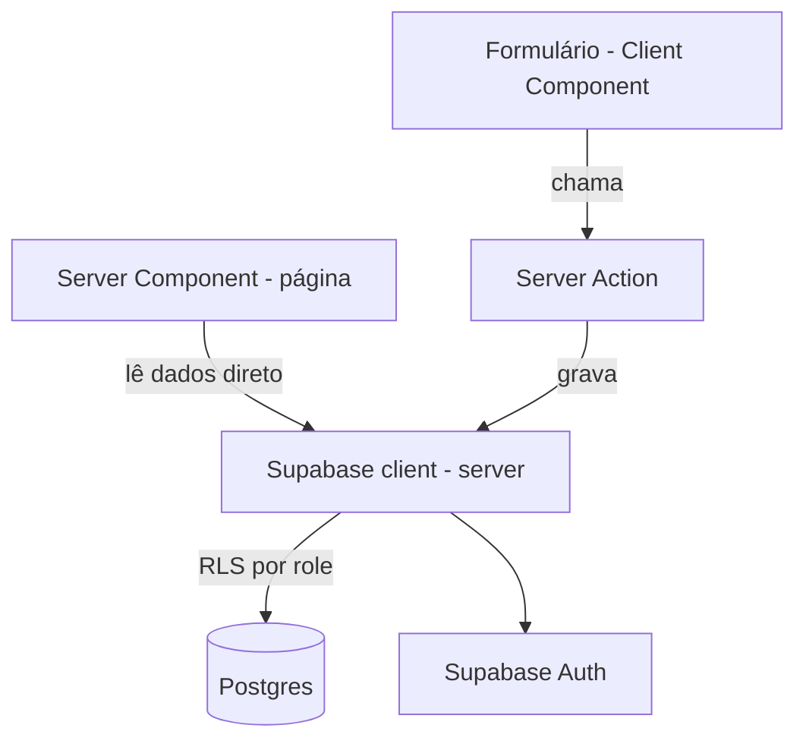

# PetManager MVP Design

**Spec**: `.specs/features/petmanager-mvp/spec.md`
**Status**: Draft

---

## Architecture Overview

Next.js App Router com Server Components para leitura de dados e Server
Actions para escrita (criar/editar/cancelar/reabrir agendamento, cadastros,
movimentações de estoque). Sem camada de API REST separada — não há
consumidor externo no v1. Supabase (Postgres + Auth) é a única fonte de
dados e autenticação; controle de acesso por papel é garantido via RLS no
banco, não apenas na UI.



Organização por domínio (feature-based), não por camada genérica — evita a
armadilha de pastas `utils/helpers/common` sem propósito claro:

```
src/
  app/
    (auth)/login/
    (dashboard)/
      agenda/
      pets/
      servicos/
      vacinas/
      estoque/
      relatorios/
      horario-funcionamento/
  features/
    agenda/
      actions.ts       # Server Actions (criar, editar, cancelar, reabrir)
      queries.ts        # leituras usadas pelos Server Components
      types.ts
    pets/
    servicos/
    vacinas/
    estoque/
    relatorios/
    auth/
  shared/
    supabase/
      client.ts         # cliente browser
      server.ts          # cliente server (usado em Server Components/Actions)
    ui/                  # componentes shadcn/ui compartilhados
```

---

## Code Reuse Analysis

N/A — primeira feature do projeto (greenfield), sem código existente para
reaproveitar. A estrutura de pastas por domínio acima é o padrão que as
próximas features (ex.: chatbot WhatsApp de triagem) devem seguir.

---

## Components

### `features/auth`

- **Purpose**: Login, sessão e checagem de papel (`dono`/`recepcionista`).
- **Location**: `src/features/auth/`
- **Interfaces**:
  - `signIn(email: string, password: string): Promise<{ error?: string }>` — Server Action de login
  - `getCurrentUserRole(): Promise<'dono' | 'recepcionista' | null>` — usado em Server Components e middleware para decidir o que renderizar
- **Dependencies**: Supabase Auth
- **Reuses**: `shared/supabase/server.ts`

### `features/horario-funcionamento`

- **Purpose**: Cadastro dos dias/horários de funcionamento do petshop.
- **Location**: `src/features/horario-funcionamento/`
- **Interfaces**:
  - `salvarHorario(input: HorarioInput): Promise<{ error?: string }>` (HOR-01, HOR-02)
  - `getHorarios(): Promise<Horario[]>`
- **Dependencies**: Supabase (tabela `horarios_funcionamento`)
- **Reuses**: `shared/supabase/server.ts`

### `features/pets`

- **Purpose**: Cadastro de tutores e pets.
- **Location**: `src/features/pets/`
- **Interfaces**:
  - `criarTutor(input: TutorInput): Promise<{ error?: string; id?: string }>` (CAD-01, CAD-02)
  - `criarPet(input: PetInput): Promise<{ error?: string; id?: string }>` (CAD-03, CAD-04)
  - `validarTelefoneBR(telefone: string): boolean` — usa lib de validação (ex. `libphonenumber-js`), não regex própria
  - `getPetsAtivos(): Promise<Pet[]>`
- **Dependencies**: Supabase (tabelas `tutores`, `pets`)
- **Reuses**: `shared/supabase/server.ts`

### `features/servicos`

- **Purpose**: Cadastro de serviços com preço interno (não exibido no
  agendamento).
- **Location**: `src/features/servicos/`
- **Interfaces**:
  - `criarServico(input: ServicoInput): Promise<{ error?: string }>` (SERV-01, SERV-03)
  - `getServicosParaAgendamento(): Promise<{ id: string; nome: string }[]>` — retorna SEM o campo de preço, por design (SERV-02)
  - `getServicosComPreco(): Promise<Servico[]>` — usado só por `relatorios` e telas restritas ao `dono`
- **Dependencies**: Supabase (tabela `servicos`)
- **Reuses**: `shared/supabase/server.ts`

### `features/agenda`

- **Purpose**: Núcleo do produto — criar, editar, cancelar, reabrir e
  concluir agendamentos.
- **Location**: `src/features/agenda/`
- **Interfaces**:
  - `criarAgendamento(input: AgendamentoInput): Promise<{ error?: string }>` (AGD-01, AGD-08)
  - `editarAgendamento(id: string, input: AgendamentoInput): Promise<{ error?: string }>` (AGD-04)
  - `cancelarAgendamento(id: string): Promise<{ error?: string }>` (AGD-05)
  - `reabrirAgendamento(id: string): Promise<{ error?: string }>` (AGD-06)
  - `concluirAgendamento(id: string): Promise<{ error?: string }>` (AGD-07)
  - `getAgendamentosPorDia(data: string): Promise<Agendamento[]>` — alimenta a visualização de horários ocupados (AGD-02)
- **Dependencies**: `features/horario-funcionamento` (slots válidos), `features/pets`, `features/servicos`
- **Reuses**: `shared/supabase/server.ts`, `shared/ui` (calendário/tabela)

### `features/vacinas`

- **Purpose**: Registro de vacinas e datas de retorno por pet.
- **Location**: `src/features/vacinas/`
- **Interfaces**:
  - `registrarVacina(input: VacinaInput): Promise<{ error?: string }>` (VAC-01)
  - `getVacinasPorPet(petId: string): Promise<Vacina[]>` (VAC-02)
- **Dependencies**: `features/pets`
- **Reuses**: `shared/supabase/server.ts`

### `features/estoque`

- **Purpose**: Entrada/saída de produtos; toda saída é tratada como venda.
- **Location**: `src/features/estoque/`
- **Interfaces**:
  - `registrarEntrada(produtoId: string, quantidade: number): Promise<{ error?: string }>` (EST-01)
  - `registrarSaida(produtoId: string, quantidade: number): Promise<{ error?: string }>` (EST-02, EST-03) — calcula `valor_total` internamente
  - `getProdutos(): Promise<Produto[]>`
- **Dependencies**: Supabase (tabelas `produtos`, `movimentacoes_estoque`)
- **Reuses**: `shared/supabase/server.ts`
- **Restrição de acesso**: rotas e Server Actions checam `getCurrentUserRole() === 'dono'` antes de executar, além da RLS (EST-04)

### `features/relatorios`

- **Purpose**: Dashboard mensal (concluídos, cancelados, faturamento),
  navegável por mês.
- **Location**: `src/features/relatorios/`
- **Interfaces**:
  - `getRelatorioMensal(ano: number, mes: number): Promise<RelatorioMensal>` (REL-01 a REL-04)
- **Dependencies**: `features/agenda`, `features/estoque`, `features/servicos`
- **Reuses**: `shared/supabase/server.ts`
- **Restrição de acesso**: exclusivo ao papel `dono` (REL-05)

---

## Data Models

```typescript
interface Usuario {
  id: string
  email: string
  role: 'dono' | 'recepcionista'
  ativo: boolean // soft-disable de funcionário desligado
}

interface HorarioFuncionamento {
  id: string
  diaSemana: 0 | 1 | 2 | 3 | 4 | 5 | 6
  horaAbertura: string // HH:mm
  horaFechamento: string
}

interface Tutor {
  id: string
  nome: string // max 255
  telefone: string // formato BR validado (DDD + número)
}

interface Pet {
  id: string
  tutorId: string
  nome: string // max 255
  raca: string
  porte: 'pequeno' | 'medio' | 'grande'
}

interface Servico {
  id: string
  nome: string
  precoInterno: number // nunca retornado para a tela de agendamento
}

interface Agendamento {
  id: string
  petId: string
  servicoIds: string[]
  dataHora: string // ISO 8601
  status: 'agendado' | 'concluido' | 'cancelado'
  criadoPor: string // usuarioId
}

interface Vacina {
  id: string
  petId: string
  dataAplicacao: string
  dataRetornoPrevista: string
}

interface Produto {
  id: string
  nome: string
  precoUnitario: number
  saldoEstoque: number
}

interface MovimentacaoEstoque {
  id: string
  produtoId: string
  tipo: 'entrada' | 'saida'
  quantidade: number
  valorTotal: number | null // calculado só nas saídas (venda)
  data: string
}
```

**Relationships**: `Pet.tutorId → Tutor.id` · `Agendamento.petId → Pet.id` ·
`Agendamento.servicoIds → Servico.id[]` (tabela de junção
`agendamento_servicos`) · `Vacina.petId → Pet.id` ·
`MovimentacaoEstoque.produtoId → Produto.id`.

RLS: todas as tabelas exigem `auth.uid()` válido (via `(select auth.uid())`
nas policies, nunca chamado linha a linha); `produtos`,
`movimentacoes_estoque` e as queries de `relatorios` adicionam checagem de
`role = 'dono'` na própria policy, não só na aplicação — dupla defesa
(AUTH-03, EST-04, REL-05).

---

## Error Handling Strategy

| Error Scenario | Handling | User Impact |
|---|---|---|
| Falha de rede/Supabase indisponível ao salvar | Server Action captura o erro e retorna `{ error: string }` genérico; formulário mantém os dados preenchidos | Mensagem "Não foi possível salvar, tente novamente" — sem perder o que já digitou |
| Telefone em formato inválido | Validação client-side (feedback imediato) + revalidação na Server Action (nunca confiar só no client) | Mensagem indicando o formato esperado (DDD + número) |
| Saída de estoque maior que o saldo | Server Action rejeita antes de gravar, checando saldo atual | Mensagem "Saldo insuficiente" com o saldo atual exibido |
| Duplo clique em salvar agendamento | Botão desabilitado via estado local (`useFormStatus`/`pending`) imediatamente após o clique | Usuário não consegue clicar de novo até a resposta do servidor |
| Login inválido | Mensagem genérica, sem indicar qual campo está errado | "E-mail ou senha inválidos" |
| Recepcionista tenta acessar rota de estoque/relatórios pela URL | Bloqueio em duas camadas: middleware do Next.js redireciona, e RLS nega a query mesmo que a rota fosse acessada | Redirecionamento para o dashboard padrão, sem exposição de dado |

---

## Risks & Concerns

| Concern | Location (file:line) | Impact | Mitigation |
|---|---|---|---|
| Sem trava de concorrência na criação de agendamento (decisão aceita na spec) | `features/agenda/actions.ts` (a criar) | Em tese, dois usuários podem criar agendamentos no mesmo horário simultaneamente | Aceito como risco de baixa probabilidade (poucos usuários internos); se virar problema real, adicionar `unique constraint` composto (`data_hora`, e não em pet) como follow-up |
| Validação de telefone BR só no client pode ser contornada | `features/pets/actions.ts` (a criar) | Dado inconsistente no banco se só validar na UI | Mitigado no design: Server Action revalida sempre, nunca confia só no client |
| Ausência de trilha de auditoria (quem cancelou/editou o quê) | Todo o app | Se houver disputa sobre "quem mexeu no agendamento", não há histórico granular | Aceito conforme spec (Assumptions); `Agendamento.criadoPor` ao menos registra o autor da criação |

> Nenhum outro risco identificado nesta fase — projeto greenfield, sem
> dívida técnica herdada.

---

## Tech Decisions (only non-obvious ones)

| Decision | Choice | Rationale |
|---|---|---|
| Camada de API | Server Actions, sem API Route Handlers/REST | Sem consumidor externo no v1; menos boilerplate (Abordagem A confirmada) |
| Validação de telefone BR | Biblioteca (`libphonenumber-js` ou equivalente), não regex própria | Princípio "library-first" — validação de telefone tem muitos edge cases (DDD, nono dígito) que uma lib já resolve |
| Controle de acesso por papel | RLS no Postgres + checagem redundante na Server Action/middleware | Defesa em profundidade — nunca confiar só na UI para dado sensível (estoque/faturamento) |
| Estrutura de pastas | Por domínio (`features/agenda`, `features/estoque`...), não por camada genérica | Evita pastas `utils/helpers/common` sem propósito; cada domínio já nasce isolado, facilitando extração futura (ex.: se `estoque` virar sua própria API um dia) |
| Multi-tenant | Não implementado no v1 (single-tenant) | Decisão já registrada na spec — adiada até tração real |

