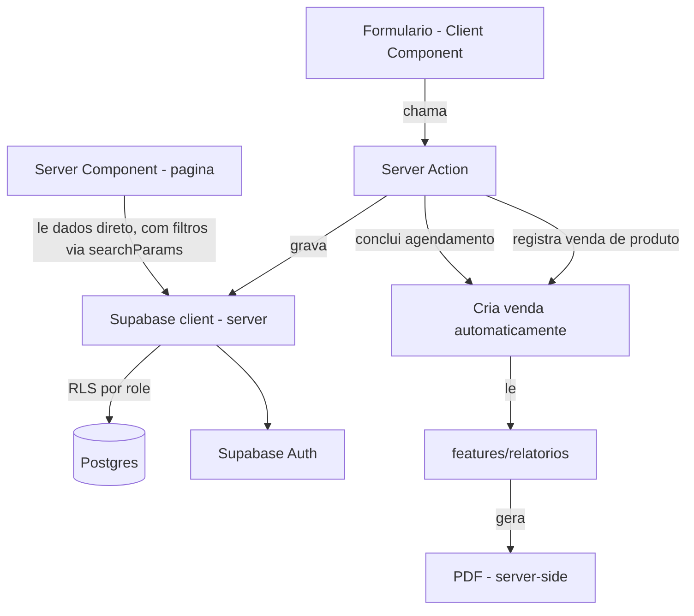

# 🐾 PetManager

Sistema de gestão para petshops de pequeno e médio porte — agenda de
banho/tosa, cadastro de tutores e pets, controle de vacinas, estoque,
vendas e relatório financeiro mensal exportável em PDF.

Desenvolvido para substituir o controle manual (caderno, WhatsApp,
planilha solta) hoje usado por petshops de Aracaju/Barra dos Coqueiros,
com o objetivo de ser **vendido a múltiplos petshops**, cada um com seu
próprio deploy.

> **Status atual**: em desenvolvimento (spec-driven). A fundação técnica
> (T1–T8: Next.js, Supabase, migrations, RLS, testes) está completa e
> validada. As features de negócio da versão completa (Vendas, Agenda
> integrada, Relatório em PDF, Filtros) estão especificadas e
> desenhadas, com implementação em andamento — ver [Status do
> Desenvolvimento](#-status-do-desenvolvimento).

---

## 📑 Sumário

- [Visão geral](#-visão-geral)
- [Funcionalidades](#-funcionalidades)
- [Fora de escopo (v1)](#-fora-de-escopo-v1)
- [Stack técnica](#-stack-técnica)
- [Arquitetura](#-arquitetura)
- [Modelo de dados](#-modelo-de-dados)
- [Estrutura de pastas](#-estrutura-de-pastas)
- [Papéis e permissões](#-papéis-e-permissões)
- [Decisões de arquitetura](#-decisões-de-arquitetura)
- [Status do desenvolvimento](#-status-do-desenvolvimento)
- [Como rodar o projeto](#-como-rodar-o-projeto)
- [Testes](#-testes)
- [Fluxo de contribuição](#-fluxo-de-contribuição)
- [Documentação (specs)](#-documentação-specs)

---

## 🎯 Visão geral

Donos de petshop controlam hoje, manualmente, agendamento de
banho/tosa, aplicação de vacinas, estoque de produtos e vendas — sem
nenhuma visão organizada de faturamento mensal. O PetManager centraliza
tudo isso em um único sistema web:

- Agenda de serviços com visualização de horários ocupados;
- Cadastro de tutores, pets, serviços e produtos;
- Histórico de vacinas e retorno previsto por pet;
- Controle de estoque com alerta de saldo baixo;
- **Área de Vendas** única (produto + serviço), fonte confiável de
  faturamento;
- **Dashboard/relatório mensal** navegável, exportável em **PDF**;
- Toda lista principal do sistema é **buscável e filtrável**.

**Modelo de implantação**: single-tenant — cada petshop-cliente roda
sua própria instância/deploy e seu próprio projeto Supabase. Não há
multi-tenancy na mesma base de dados.

---

## ✅ Funcionalidades

| Módulo | Descrição |
|---|---|
| **Autenticação e Papéis** | Login por e-mail/senha (Supabase Auth), dois papéis: `dono` e `recepcionista`, com acesso restrito por rota e por RLS |
| **Horário de Funcionamento** | Cadastro de dias/horários de abertura, usado para limitar os slots da agenda |
| **Tutores e Pets** | Cadastro com validação de telefone brasileiro, porte do pet e vínculo tutor↔pet |
| **Serviços** | Cadastro de serviços (banho, tosa...) com preço interno **nunca exibido** na tela de agendamento |
| **Agenda** | Criar, editar, cancelar, reabrir e concluir agendamentos; concluir gera venda automaticamente; reabrir um concluído estorna a venda |
| **Vacinas** | Registro de vacina aplicada + data de retorno prevista, histórico completo por pet |
| **Estoque** | Cadastro de produto, entrada de estoque, alerta de saldo baixo — **sem saída manual**: toda saída só acontece através de uma venda |
| **Vendas** ⭐ | Tela única para vendas de produto (avulsa, no balcão) e de serviço (gerada ao concluir agendamento) — fonte única de faturamento |
| **Relatórios / Dashboard** | Contagem de concluídos/cancelados e faturamento total por mês, navegável para qualquer mês anterior, com **exportação em PDF** |
| **Filtros de Pesquisa** ⭐ | Busca textual + filtro por atributo em todas as listas principais (Agenda, Pets, Vacinas, Produtos, Vendas), combináveis, sem recarregar a página |

⭐ = funcionalidades novas em relação ao MVP original, incorporadas
após validação de um protótipo com donos de petshop reais (ver
[Decisões de arquitetura](#-decisões-de-arquitetura)).

---

## 🚫 Fora de escopo (v1)

Excluído deliberadamente desta versão, para não gerar scope creep:

| Item | Motivo |
|---|---|
| Pagamento online | Não é dor prioritária hoje |
| Multi-tenant (vários petshops numa base) | Cada petshop tem seu próprio deploy |
| Múltiplas unidades/filiais | Fora do nicho-alvo (unidade única) |
| Agenda por funcionário/tosador | Agenda única do estabelecimento |
| Autoatendimento do tutor | Tutor não acessa o sistema |
| Chatbot WhatsApp | Feature separada, pós-validação comercial |
| API pública / rate limiting | Sistema interno, sem API exposta |
| Trilha de auditoria campo-a-campo | `vendas`/`movimentacoes_estoque` já registram quem criou; log completo fica para versão futura |

---

## 🧱 Stack técnica

| Camada | Tecnologia |
|---|---|
| Framework | **Next.js (App Router)** + TypeScript |
| UI | **Tailwind CSS** + **shadcn/ui** |
| Backend | **Server Actions** do Next.js (sem API REST separada) |
| Dados / Auth | **Supabase** (Postgres + Supabase Auth) |
| Autorização | **RLS (Row Level Security)** como camada real de controle de acesso — não só na UI |
| PDF | **`@react-pdf/renderer`** — geração server-side, sem headless browser |
| Testes unitários | **Vitest** |
| Testes e2e | **Playwright** |
| Deploy | **Vercel** |

Não há camada de API REST própria: Server Components fazem toda
leitura direto do Supabase, e Server Actions fazem toda escrita (ver
[AD-001](#-decisões-de-arquitetura)).

---

## 🏗️ Arquitetura



**Princípios centrais:**

- Nenhuma escrita passa por fora de uma Server Action; nenhuma leitura
  passa por fora de um Server Component ou de uma query tipada.
- RLS é a camada real de segurança — a UI apenas reflete as permissões,
  nunca as substitui.
- **Vendas é a fonte única de faturamento.** Nunca se soma
  "agendamentos concluídos" + "saídas de estoque" separadamente — tudo
  passa pela tabela `vendas`, eliminando divergência de cálculo.
- Saída de estoque só existe como efeito colateral de uma venda de
  produto (função Postgres transacional `registrar_venda_produto`),
  nunca como ação isolada.

---

## 🗃️ Modelo de dados

Principais entidades (nomes simplificados; ver
[`design.md`](#-documentação-specs) para o schema completo):

```typescript
interface Produto {
  id: string
  nome: string
  categoria: string
  precoUnitario: number
  saldoEstoque: number
  estoqueMinimo: number // alimenta o alerta de estoque baixo
}

interface MovimentacaoEstoque {
  id: string
  produtoId: string
  tipo: 'entrada' | 'saida'   // 'saida' só é criada via venda
  quantidade: number
  vendaId: string | null      // rastreia qual venda causou a saída
  data: string
}

interface Venda {
  id: string
  tipo: 'servico' | 'produto'
  agendamentoId: string | null // só quando tipo = 'servico'
  produtoId: string | null     // só quando tipo = 'produto'
  servicoIds: string[] | null  // snapshot dos serviços vendidos
  quantidade: number           // sempre 1 para serviço; variável para produto
  valorTotal: number
  criadoPor: string
  criadoEm: string              // ISO 8601, base do filtro por mês
}
```

**Constraint chave**: cada `Venda` deve ter exatamente um de
`agendamentoId`/`produtoId` preenchido, de acordo com o `tipo` (`CHECK`
no banco).

**Migrations:**

| Migration | Conteúdo |
|---|---|
| `0001`–`0003` (herdadas do MVP) | `profiles` (papéis), tabelas de domínio (tutores, pets, serviços, agendamentos, vacinas, produtos), RLS completo |
| `0004_vendas.sql` (nova, aditiva) | Tabela `vendas`, colunas `estoque_minimo` (produtos) e `venda_id` (movimentações), função Postgres transacional `registrar_venda_produto(produto_id, quantidade)`, RLS de `vendas` |

Toda policy de RLS usa `(select auth.uid())` — nunca `auth.uid()`
chamado linha a linha (ver [AD-003](#-decisões-de-arquitetura)).

---

## 📂 Estrutura de pastas

Organização **por domínio de negócio**, nunca por camada genérica
(`utils/`, `helpers/`, `common/`):

```
src/
  app/
    (auth)/login/
    (dashboard)/
      agenda/
      pets/
      servicos/
      vacinas/
      estoque/
      vendas/                    # NOVO
      relatorios/
      horario-funcionamento/
  features/
    agenda/          # actions.ts · queries.ts · types.ts · components/
    pets/
    servicos/
    vacinas/
    estoque/          # sem ação de saída direta
    vendas/            # NOVO — fonte única de faturamento
    relatorios/        # lê de vendas, gera PDF
    auth/
  shared/
    supabase/
      client.ts        # cliente browser-side
      server.ts        # cliente server-side
    ui/                 # componentes shadcn/ui
    filters/            # NOVO — busca/filtro reutilizável
      use-list-filters.ts
      search-filter-bar.tsx
    pdf/                 # NOVO — geração de PDF server-side
      relatorio-pdf.tsx
supabase/
  migrations/
    0001_profiles.sql
    0002_dominio.sql
    0003_rls.sql
    0004_vendas.sql
e2e/
  *.spec.ts
```

---

## 🔐 Papéis e permissões

| Recurso | `dono` | `recepcionista` |
|---|---|---|
| Agenda (criar/editar/cancelar/concluir) | ✅ | ✅ |
| Tutores, Pets, Vacinas | ✅ | ✅ |
| Cadastro de Serviços | ✅ | ❌ |
| Estoque (cadastro de produto, entrada) | ✅ | ❌ |
| Venda de produto avulsa | ✅ | ❌ |
| Listagem de Vendas | ✅ | ✅ |
| Relatório mensal / Exportar PDF | ✅ | ❌ |

A restrição é aplicada em **duas camadas independentes**: middleware de
rota (UX) e RLS no Postgres (segurança real) — a UI nunca é a única
barreira.

---

## 🧭 Decisões de arquitetura

Registradas em `.specs/STATE.md`, resumidas aqui:

| ID | Decisão |
|---|---|
| **AD-001** | Sem API REST separada — Server Actions escrevem, Server Components leem direto do Supabase. Reversível se surgir um segundo cliente (app mobile, integração externa). |
| **AD-002** | Estrutura por domínio (`features/<dominio>/`), nunca por camada genérica. Código só vai para `shared/` se for genuinamente cross-cutting. |
| **AD-003** | RLS sempre com `(select auth.uid())` — cacheado pelo planner por statement, evita reavaliação linha a linha em tabelas grandes. |
| **AD-004** | Toda task avalia um roster fixo de skills de segurança/qualidade (testes de segurança, pentesting, boas práticas Postgres/TypeScript/React, arquitetura) antes de ser considerada concluída — o software é vendido a clientes reais. |
| **AD-005** | A partir de T8, nada vai direto para `main`. Cada task roda em branch `task/T<N>-<slug>`, sobe PR, é integrada via **squash merge** só depois do gate (build/test) passar. |
| **AD-006** | `petmanager-completo` substitui `petmanager-mvp` como fonte da verdade. Escopo confirmado como single-tenant + Área de Vendas unificada + filtros de pesquisa + exportação em PDF, após validação com donos de petshop via protótipo em v0.dev (**nenhum código do protótipo foi reaproveitado** — serviu só de referência visual). |

**Principais decisões técnicas (`design.md`):**

- **Geração de PDF**: `@react-pdf/renderer`, 100% server-side — leve o
  suficiente para a serverless da Vercel, sem depender de
  Chromium/Puppeteer.
- **Faturamento**: sempre `SUM(vendas.valor_total)` — nunca dois
  cálculos separados (agendamentos + estoque).
- **Concluir agendamento → cria venda**: feito dentro de uma função
  Postgres transacional, para nunca deixar um agendamento concluído
  sem sua venda correspondente (ou vice-versa) por falha de rede no
  meio do caminho.
- **Filtros de lista**: estado guardado na URL (`searchParams`), não em
  estado local — permite recarregar a página (F5) sem perder o filtro
  e compartilhar um link já filtrado.

---

## 📊 Status do desenvolvimento

O projeto segue um fluxo **spec-driven**: cada feature nasce de um
`spec.md` (requisitos) → `design.md` (arquitetura) → `tasks.md` (plano
de execução rastreável), guardados em `.specs/`.

### Feature ativa: `petmanager-completo`

| Fase | Conteúdo | Status |
|---|---|---|
| Phase 1 | Fundação restante (cliente Supabase browser, `shared/filters`, deploy) | 🔄 Em andamento — próximo passo: **T2** |
| Phase 2 | Autenticação e Papéis | ⏳ Pendente |
| Phase 3 | Cadastros base (horário, tutores/pets, serviços) | ⏳ Pendente |
| Phase 4 | Estoque + migration `0004_vendas.sql` | ⏳ Pendente |
| Phase 5 | Vendas | ⏳ Pendente |
| Phase 6 | Agenda (integrada a Vendas) | ⏳ Pendente |
| Phase 7 | Vacinas | ⏳ Pendente |
| Phase 8 | Relatórios + PDF | ⏳ Pendente |

**Já entregue e reaproveitado integralmente** (herdado da fase MVP,
T1–T8): projeto Next.js + TypeScript + Tailwind + shadcn/ui, projeto
Supabase configurado, migrations `0001`–`0003` (profiles, tabelas de
domínio, RLS completo), Vitest, Playwright e cliente Supabase
server-side.

**Requisitos rastreados**: 43 requisitos funcionais (`AUTH-*`,
`HOR-*`, `CAD-*`, `SERV-*`, `AGD-*`, `VAC-*`, `EST-*`, `VEN-*`,
`REL-*`, `FILT-*`) mapeados 1:1 com as tasks de `tasks.md` — 3 já
satisfeitos (herdados do MVP), 40 aguardando execução.

> ⚠️ Pendência conhecida: rodar `npx playwright install --with-deps &&
> npm run test:e2e` fora do sandbox de desenvolvimento para confirmar o
> e2e de ponta a ponta.

---

## 🚀 Como rodar o projeto

> Pré-requisitos: Node.js LTS, uma conta/projeto Supabase e as
> variáveis de ambiente configuradas.

```bash
# instalar dependências
npm install

# configurar variáveis de ambiente do Supabase
cp .env.example .env.local
# preencher NEXT_PUBLIC_SUPABASE_URL e NEXT_PUBLIC_SUPABASE_ANON_KEY

# aplicar as migrations no projeto Supabase
# (via Supabase CLI ou MCP, conforme o fluxo do projeto)

# rodar em desenvolvimento
npm run dev
```

Acesse `http://localhost:3000`.

---

## 🧪 Testes

| Tipo | Cobertura | Comando |
|---|---|---|
| Unitário (Vitest) | Server Actions e Queries — todos os branches, 1:1 com os critérios de aceite da spec | `npm run test:unit` |
| E2E (Playwright) | Fluxos de página completos (login, agenda, vendas, relatórios) e bloqueio de rota por papel | `npm run test:e2e` |
| Build/Lint | Migrations, RLS, função Postgres transacional e config validados via gate de build | `npm run build && npm run lint` |

**Gates de qualidade** usados antes de qualquer merge:

| Gate | Quando usar | Comando |
|---|---|---|
| Quick | Tasks só com testes unitários | `npm run test:unit` |
| Full | Tasks com e2e | `npm run test:unit && npm run test:e2e` |
| Build | Fim de fase ou tasks de config/schema | `npm run build && npm run lint && npm run test:unit && npm run test:e2e` |

---

## 🔀 Fluxo de contribuição

A partir da task T8, **nada vai direto para `main`** (AD-005):

1. Cada task (ou grupo pequeno de tasks relacionadas) nasce numa branch
   `task/T<N>-<slug>`.
2. Abre-se um Pull Request.
3. O PR só é integrado após o **gate da task** (build/test) passar.
4. Integração via **squash merge** — `main` mantém 1 commit por task,
   fácil de ler e reverter.
5. A branch é apagada após o merge.

> Nota: branch protection na `main` ainda não está habilitada
> tecnicamente no GitHub (limitação do token atual) — é seguida como
> disciplina manual até ser configurada em Settings → Branches.

---

## 📚 Documentação (specs)

Toda a especificação, o design técnico e o plano de execução vivem em
`.specs/`, seguindo um fluxo spec-driven:

```
.specs/
  STATE.md                              # decisões de arquitetura + handoff atual
  LESSONS.md / lessons.json             # lições aprendidas entre features
  features/
    petmanager-mvp/                     # versão inicial — histórico, T1-T8 reaproveitados
      spec.md
      design.md
      tasks.md
    petmanager-completo/                # fonte da verdade atual
      spec.md                           # requisitos e user stories
      design.md                         # arquitetura, modelo de dados, decisões técnicas
      tasks.md                          # plano de execução (41 tasks, 8 fases)
```

Para entender **o quê** o sistema deve fazer, comece por
`spec.md`; para entender **como**, veja `design.md`; para acompanhar
**o progresso**, veja `tasks.md` e o bloco *Handoff* em `STATE.md`.
